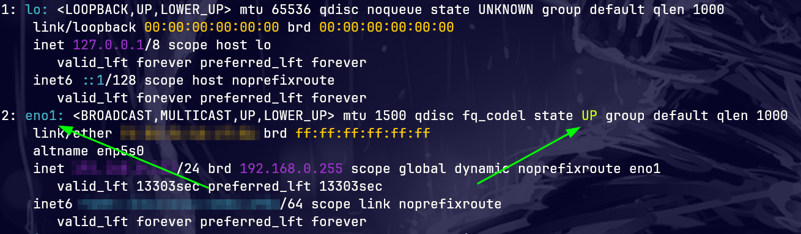

# macsimus


macsimus is a fast bash based mac address randomizer for linux systems.

## Requirements:
  * sudo priviledges
  * linux system

## Instructions (simple)

```sh
git clone https://github.com/zer0theory/macsimus.git
cd macsimus
sudo bash macsimus.sh
```


## Troubleshooting

If the network interface auto detect does not work you can find the interface yourself using this command from a terminal.

```sh
ip --color=auto addr show
```


In the above example the active interface is **eno1**

